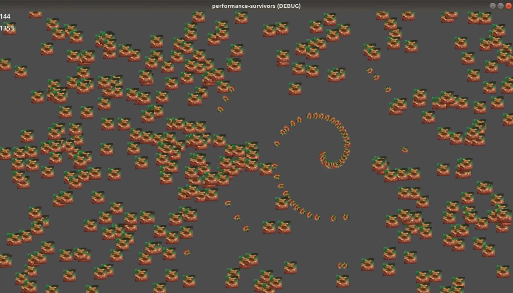

# performance-survivors

Performance test using  [Godot](https://github.com/godotengine/godot), drawing 1792 objects with collision detection on a 7-year-old laptop at 135 fps.

This is not done using nodes, this is made using servers and the object pooling technique.

As you can see the window is in debug mode so probably it can run faster in release mode. This is a [demonstration video](https://x.com/_guilleatm/status/1715388603583414680?s=20).

Running on Intel - Intel(R) HD Graphics 510 (SKL GT1)
